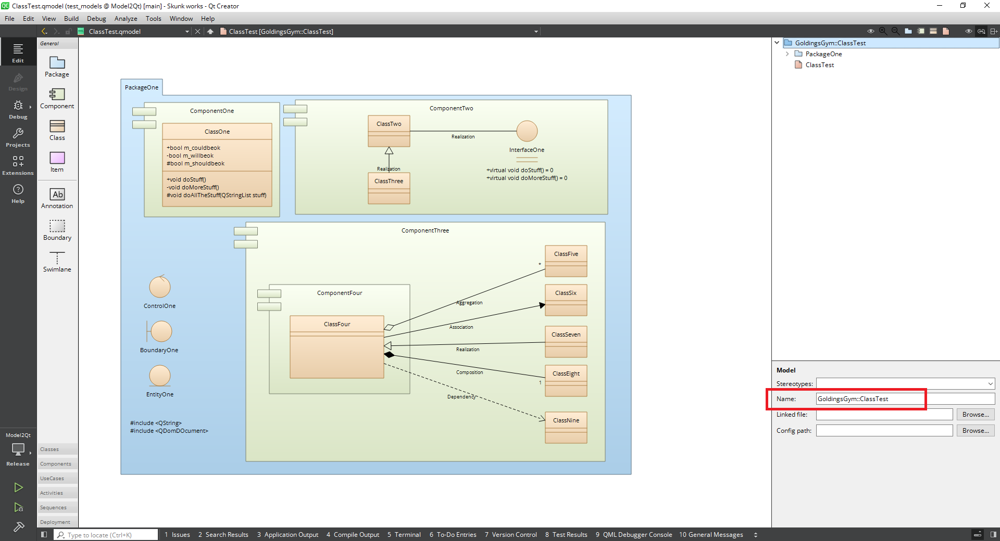
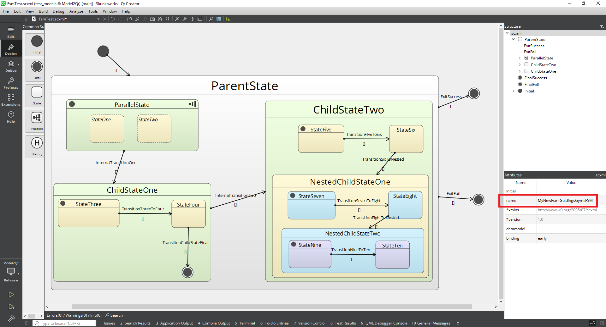
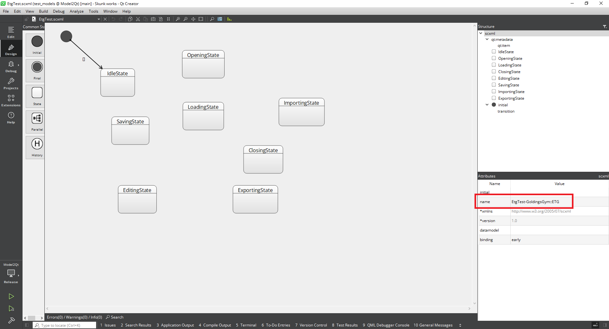
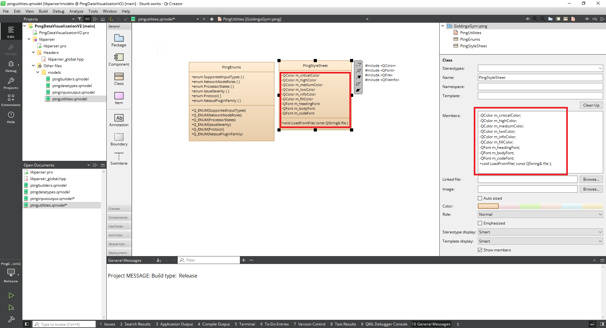
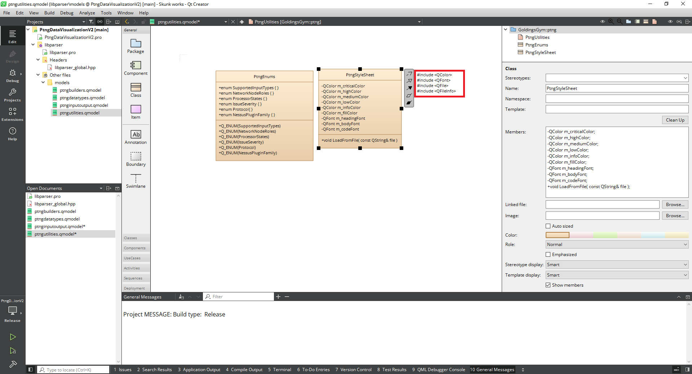

# Skunkworks software

## model2qt.exe usage

### Options and switches

```
Usage: C:\Tools\GoldingsGymStatic\model2qt.exe [options] preserve-case clobber namespace qtclass qtfsm qtsmf etg
model2qt Converts an scxml or class diagram UML file created with Qt Creator into classes, with pre-defined interfaces

Options:
  -?, -h, --help      Displays help on commandline options.
  --help-all          Displays help, including generic Qt options.
  -v, --version       Displays version information.
  -i, --input <file>  Input file

Arguments:
  preserve-case       Preserve case for file names - may be ignored for some input types
  clobber             Overwrite existing files - may be ignored for some input types
  namespace           Use package and component names (if available) as namespaces - may be ignored for some input types
  qtclass             Qt Creator class model diagram to QObjects
  qtfsm               Finite State Machine with QObjects
  qtsmf               Finite State Machine with QStates
  etg                 Create classes for Events, Transitions Guards pattern. Only with "qtsmf" output flag
```

### Models - namespaces

For class model diagrams, modify the top level 'Name' tag to the namespace, e.g. GoldingsGym::MyLibrary.

For state charts (inc. ETG state charts) modeify the attributes 'name' tag to add the namespace onto the state machine name with a hyphen delimiter, e.g. MyFsm-GoldingsGym::MyFsm

#### Class model diagram



#### State chart (simple pattern)



#### State chart (events, transitions and guards pattern)



### Models - members

Enter functions and variables in the attributes section on the right hand pane. Use '-' for private, '+' for public and '#' for protected. They will appear in the class on the mainwindow.



### Models - annotation

Use a single annotation to include additional headers in the generated *.hpp files. Enter them as they would appear if typed manually:



### Examples:

```
model2qt.exe -i class_model.qmodel qtclass clobber namespace
model2qt.exe -i state_machine.scxml qtfsm preserve_case
model2qt.exe -i state_machine.scxml qtsmf preserve_case namespace
model2qt.exe -i state_machine.scxml qtfsm etg clobbber
```

## qhostrecon.exe usage

### Options and switches

```
Usage: C:\Tools\GoldingsGymStatic\qhostrecon.exe [options] local all-nics all-nics-config all-ips nic-for-ip domain remote resolve all silent
qhostrecon Queries an SSL server and examines certificate details. Can also provide details of internal networking configuration.

Options:
  -?, -h, --help                                   Displays help on commandlineoptions.
  --help-all                                       Displays help, including generic Qt options.
  -v, --version                                    Displays version information.
  -t, --target <IP Address(es) or domain name(s)>  Comma-delimited list of host(s) to query.
  -x, --xml <file>                                 Write to XML file. This is ignored for some operations.

Arguments:
  local                                            Local host checks
  all-nics                                         Local host check - show all NICs
  all-nics-config                                  Local host checks - show configuration for all NICs
  all-ips                                          Local host checks - show all IP addresses on the local host
  nic-for-ip                                       Local host checks - show NICs for all IP addresses on the local host
  domain                                           Local host checks - domain membership and hostname
  remote                                           Remote host checks
  resolve                                          Remote host checks - resolves each host in the target option
  all                                              All checks for the selected mode (local or remote)
  silent                                           Do not print to console (only makes sense if you have set the -x/--xml 														   option)
```

### Examples:

```
qhostrecon.exe local all-nics
qhostrecon.exe local all-nics-config
qhostrecon.exe local all-ips
qhostrecon.exe local nic-for-ip
qhostrecon.exe local domain
qhostrecon.exe local all

qhostrecon.exe remote resolve -t sun.com,microsoft.com
qhostrecon.exe remote all -t sun.com,microsoft.com
```

## qnetdiags.exe usage

### Options and switches

```
Usage: C:\Tools\GoldingsGymStatic\qnetdiags.exe [options] client server tcp http ssl
qnetdiags Provides diagnostics for TCP, SSL and HTTP client/server.

The application of SSL is inferred by the presence of the key and cert options.

Options:
  -?, -h, --help                      Displays help on commandline options.
  --help-all                          Displays help, including generic Qt options.
  -v, --version                       Displays version information.
  -t, --target <IP address>           Target IP address. Required for all client connections.
  -p, --port <int>                    Port number. Required for both client connections and server listen.
  -c, --cert <file>                   CA certificate file. Required for SSL (TCP and HTTP) client and server.
  -k, --key <file>                    Private key file. Required for SSL (TCP and HTTP) client and server.
  -s, --supplicant <file>             Client certificate file. Required for SSL (TCP and HTTP) client.
  -m, --method <get|put|post|delete>  HTTP method. Required for HTTP(s) client.
  -f, --file <file>                   File containing data to append to HTTP(s) client with either the put or post method.

Arguments:
  client                              Client connection diagnostics.
  server                              Server listen diagnostics.
  tcp                                 TCP client or server.
  http                                HTTP client or server.
  ssl                                 Use SSL if certificate and key files are valid.
```

### Examples:

```
qnetdiags.exe server tcp -c SERVER-CERT.pem -k SERVER-KEY.pem -p 443
qnetdiags.exe client tcp -c .ERVER-CERT.pem -s CLIENT-CERT.pem -t localhost -p 443

qnetdiags.exe server http ssl -c SERVER-CERT.pem -k SERVER-KEY.pem -p 443
qnetdiags.exe client http -c SERVER-CERT.pem -s CLIENT-CERT.pem -m get -t localhost -p 443
```

