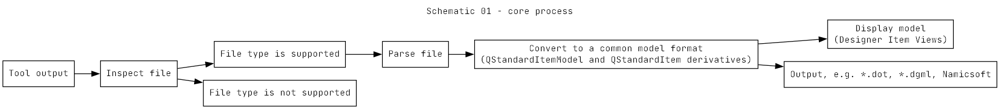

\mainpage
# Overview
The Penetration Test Next Generation (PTNG) library is intended to provide parsing and display capabilities for the output of many of the most common penetration test tools.

Most of these tools, such as nmap, Nessus, SslScan and others have proprietary output formats which make interrogating the output difficult, error prone and and time consuming.

The library is written in pure Qt (version 6.7.2 at the time of going to press) and uses some core Qt technologies as its' cornerstone. The core process is illustrated below:

The classes associated with each step are detailed in the main body of this documentation.

# Tools (sub-projects) provided with the PtngDataVisualizationV2 library subdirs project

ifident.exe: Input file identifier - takes an arbitrary file, usually output from a penetration test/assessment tool, and attempts to identify the source tool.

nmap2dot.exe: Produces a Graphviz dot.exe runcontrol, from an nmap *.xml output file, for a directed graph showing the discovered network map with host detail.

nessus2dot.exe: Produces a Graphviz dot.exe runcontrol, from a nessus *.nessus output file, for a directed graph showing the discovered network map with issue/severity detail.

nmap2dgml.exe: Produces a Directed Graph Markup Language (DGML) file, from an nmap *.xml output file, for a directed graph showing the discovered network map with host detail.

nessus2dgml.exe: Produces a Directed Graph Markup Language (DGML) file, from a nessus *.nessus output file, for a directed graph showing the discovered network map with issue/severity detail.

nmap2text.exe: Produces csv and tsv files with port status details from an nmap *.xml file. Can be pasted into a report or spreadsheet.

nessus2text.exe: Produces csv and tsv files with issue details from a Nessus *.nessus file. Can be pasted into a report or spreadsheet.

libparsertest.exe: A test harness written with the Qt Test Framework for the libparser libraries.
